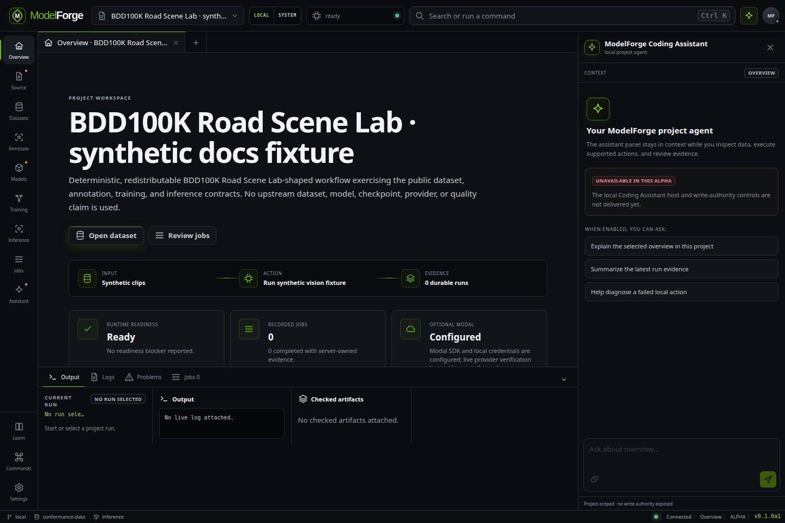
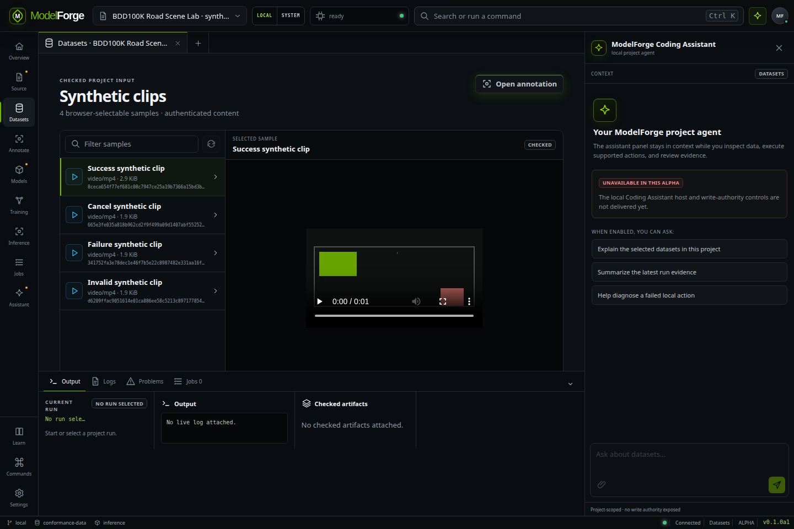
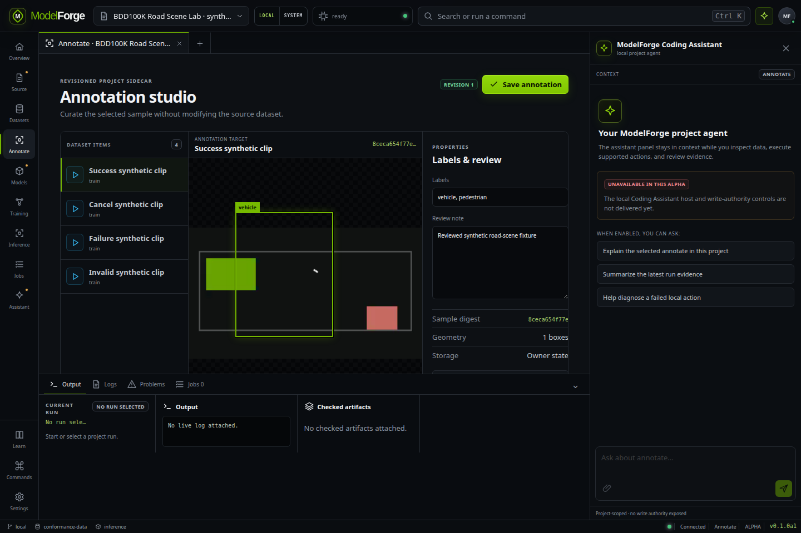
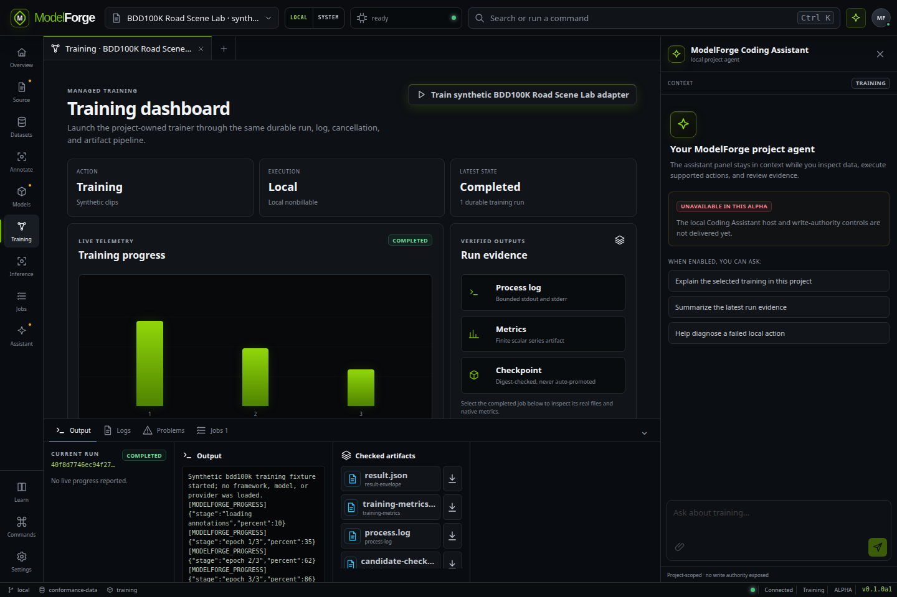
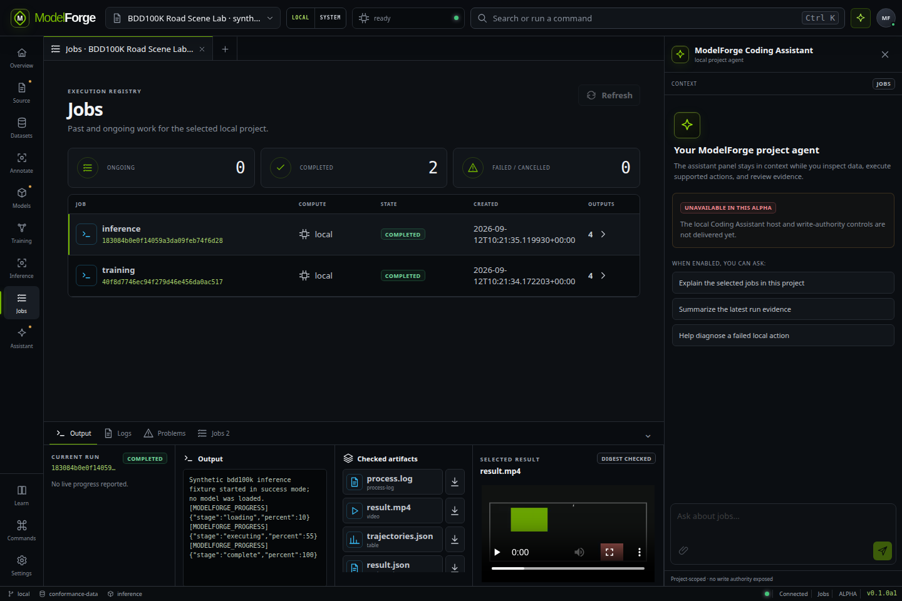
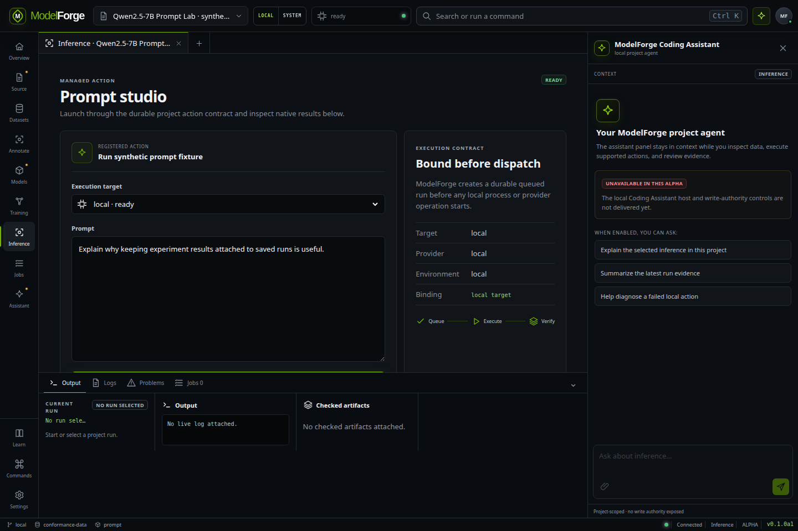
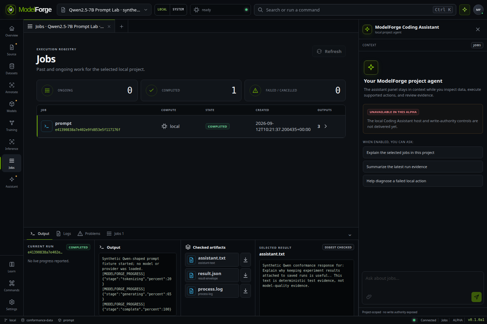
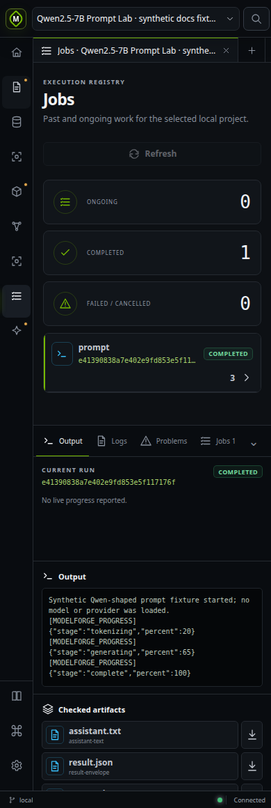
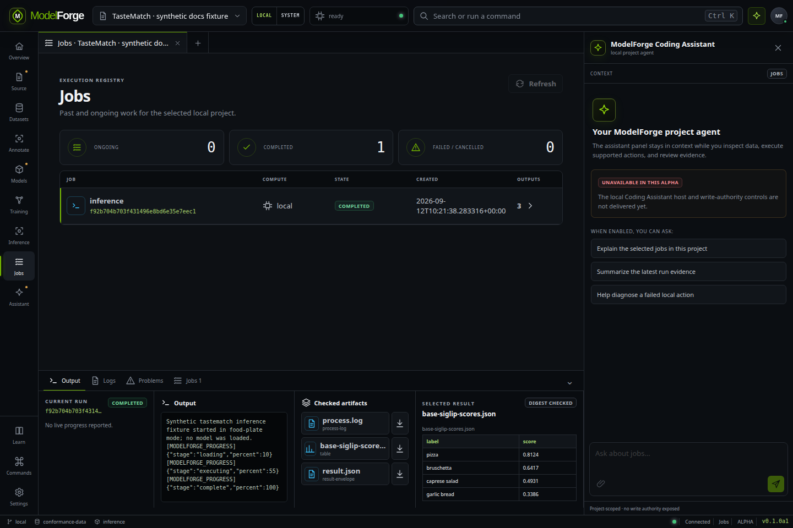

# Your first ModelForge experiment

This guide starts with an offline installation check, then walks through two
supported real-project shapes: BDD100K road-scene tracking and Qwen prompting.
It separates terminal setup from browser interaction so you always know which
tool owns the next step.

> [!NOTE]
> The screenshots show the current compiled workbench talking to the real
> ModelForge backend and managed-run lifecycle. To keep the documentation
> redistributable, the capture journey uses clearly labelled synthetic fixtures:
> an authored moving-shape video, an authored prompt response, and authored
> TasteMatch-shaped scores. No restricted dataset, model, checkpoint, personal
> prompt, credential, or prior execution evidence appears in the images.

## 1. Install and check the base package

### Prerequisites

- Linux x86-64
- CPython 3.12
- Git
- A current Chromium-family browser

Clone ModelForge and install it in a fresh virtual environment:

```bash
git clone https://github.com/mathewturnell/modelforge.git
cd modelforge
python3.12 -m venv .venv
.venv/bin/python -m pip install .
```

Run the bundled Synthetic Threshold Lab. It needs no account, GPU, model, or
network access and makes no model-quality claim:

```bash
.venv/bin/modelforge demo run --state-root /tmp/modelforge-alpha-state
.venv/bin/modelforge runs list --state-root /tmp/modelforge-alpha-state
```

The first command should print a completed run with checked JSON result
artifacts. The second should return the same durable run from the state
database.

Start the browser workbench against that state:

```bash
.venv/bin/modelforge serve --state-root /tmp/modelforge-alpha-state
```

ModelForge prints a `http://127.0.0.1:.../#token=...` URL and normally opens it.
If the browser does not open, copy the complete URL—including the fragment—into
your browser. Leave the terminal running while you use the workbench. Stop it
with `Ctrl-C`.

## 2. Find your way around

The title bar contains the `Project` selector. The left rail contains
`Overview`, `Dataset`, `Annotation`, `Training`, `Inference`, `Jobs / Runs`,
and `Settings`, alongside planned destinations that are visibly marked
unavailable or partial. The right-hand project assistant panel preserves the
established layout but stays disabled until its server authority exists. The
bottom evidence panel keeps status, `Output`, logs, problems, jobs, and checked
artifacts visible while you move around the project.



*Current UI with the BDD100K-shaped synthetic documentation fixture selected.
The Overview explains readiness and available capabilities before launch.*

The bundled offline example is enough to learn the shell. Real ML examples
require explicit source, model, data, and environment setup before ModelForge
will register them as ready.

## 3. Worked vision example: BDD100K Road Scene Lab

This workflow runs the pinned MeMOTR integration against one selected BDD100K
MOT video and returns a checked MP4 tracking result. It is inference only; it
does not train or make a tracking-quality claim.

### Before you begin

You need:

- access to BDD100K MOT 2020 data under its upstream terms;
- the pinned MeMOTR source revision;
- the published MeMOTR BDD100K checkpoint with the expected SHA-256;
- a Linux x86-64 host with a compatible NVIDIA CUDA/PyTorch environment;
- OpenCV, PyYAML, NumPy, ffmpeg, and the pinned MeMOTR requirements.

ModelForge does not authenticate to BDD100K, accept terms, download the gated
data/checkpoint, or modify CUDA and system packages.

### Plan and bind the external material

First inspect the read-only plan:

```bash
.venv/bin/modelforge examples setup plan \
  --example bdd100k-road-scene-lab \
  --external-root /srv/modelforge-examples
```

After reviewing the reported revisions and terms, fetch only the public source:

```bash
.venv/bin/modelforge examples setup fetch \
  --example bdd100k-road-scene-lab \
  --external-root /srv/modelforge-examples \
  --only memotr-source --confirm
```

Acquire the dataset and checkpoint yourself. Verify the checkpoint, then bind
the paths you already control:

```bash
sha256sum /models/memotr_bdd100k.pth
# expected: c90604ab0b4036d1f6b0d5ff4be7c1ea41ff581e344b234fb802b24f9d3487bd

.venv/bin/modelforge examples setup fetch \
  --example bdd100k-road-scene-lab \
  --external-root /srv/modelforge-examples \
  --use bdd100k-data=/data/bdd100k \
  --use memotr-checkpoint=/models/memotr_bdd100k.pth \
  --confirm
```

Create the example environment:

```bash
.venv/bin/modelforge examples setup install \
  --example bdd100k-road-scene-lab \
  --external-root /srv/modelforge-examples \
  --confirm
```

This creates an empty Python 3.12 environment at
`/srv/modelforge-examples/bdd100k-road-scene-lab/environment`. Install the
host-compatible CUDA/PyTorch and project dependencies into that environment by
following the pinned upstream instructions. ModelForge does not execute the
fetched checkout during setup.

### Create and register the local runtime configuration

Copy
[`project.local.template.json`](../examples/bdd100k-road-scene-lab/project.local.template.json)
to an owner-only directory outside the checkout. Replace every placeholder with:

- the absolute path to this example directory;
- the example environment's Python interpreter;
- the pinned MeMOTR checkout;
- the BDD100K dataset root;
- one selected MP4's relative path, byte size, and SHA-256;
- the verified checkpoint path and SHA-256.

Do not place the filled configuration in Git. Register it with the same state
root you will serve:

```bash
.venv/bin/modelforge project register \
  --state-root /tmp/modelforge-alpha-state \
  --config /secure/bdd100k.local.json

.venv/bin/modelforge serve --state-root /tmp/modelforge-alpha-state
```

Registration is local-only and does not start the model.

### Select, run, and inspect in the browser

1. In `Project`, choose `BDD100K Road Scene Lab`. On `Overview`, confirm the
   readiness badge is `ready`. If it is not, read the reason before continuing.
2. Open `Dataset`. Choose the registered video in `Dataset samples`. A checked
   native preview should appear on the right.



*The screenshot uses the authored synthetic clip; a configured BDD100K project
shows the selected local video in the same implemented view.*

3. Open `Annotation` to attach revisioned labels, review notes, and normalized
   boxes to the selected sample. Saving creates an owner-state sidecar bound to
   the sample SHA-256; it does not alter the video or project checkout.



*The deterministic fixture proves the real dataset-to-annotation service and
responsive editor. It is not upstream BDD100K data or annotation-quality
evidence.*

4. `Training` is enabled only when the registered project declares an exact
   `training_process` action. The qualification fixture exercises the real
   durable run, progress, metrics, checkpoint, cancellation, and artifact path;
   the retained MeMOTR example remains inference-only until its project owns a
   reviewed public trainer.



5. Open `Inference`. Confirm `Execution target` is `local · ready`, check the
   filename under `Selected input`, and select `Run MeMOTR on selected video`.
6. ModelForge switches to `Jobs / Runs`. The new run moves through queued and
   running state; `Output` shows bounded process logs and reported progress.
7. Wait for `completed`. Under `Checked artifacts`, open `result.mp4` to play
   the digest-checked tracking output. `result.json`, its manifest, and
   `process.log` remain available separately.



*Current result UI using an authored moving-shape video. It demonstrates the
same managed run, checked artifact, and native video path—not MeMOTR quality.*

If the action fails, the run remains in `Jobs / Runs`. Read the failure text and
`process.log`; ModelForge does not convert an invalid or partial result into a
success.

## 4. Worked prompt example: Qwen2.5-7B Prompt Lab

This workflow sends bounded messages and generation settings to an explicitly
pinned offline Qwen2.5-7B-Instruct snapshot and returns checked assistant text.
The retained real prompt example has no dataset or training action. The
deterministic Qwen-shaped conformance project separately verifies conversation
sample loading, revisioned curation, managed training evidence, and prompt
results without loading the upstream model or making a fine-tuning claim.

### Before you begin

You need the exact external snapshot at revision
`a09a35458c702b33eeacc393d103063234e8bc28` (roughly 15.2 GiB), enough disk and
RAM/VRAM, and the reviewed direct Python dependencies. CPU execution is
supported but slow; compatible CUDA is practical. Review the upstream model
card and licence before acquisition. ModelForge does not log in to Hugging Face
or download the snapshot for you.

Plan the setup, bind an existing exact snapshot, and create the environment:

```bash
.venv/bin/modelforge examples setup plan \
  --example qwen-prompt-lab \
  --external-root /srv/modelforge-examples

.venv/bin/modelforge examples setup fetch \
  --example qwen-prompt-lab \
  --external-root /srv/modelforge-examples \
  --use qwen-model=/models/Qwen2.5-7B-Instruct/snapshots/a09a35458c702b33eeacc393d103063234e8bc28 \
  --confirm

.venv/bin/modelforge examples setup install \
  --example qwen-prompt-lab \
  --external-root /srv/modelforge-examples \
  --confirm --install-requirements
```

The last command may contact package indexes. Its direct versions are pinned,
but they are not a hash-locked transitive environment.

Copy
[`project.local.template.json`](../examples/qwen-prompt-lab/project.local.template.json)
outside the checkout. Set the example repository, environment interpreter, and
exact snapshot paths, then register it:

```bash
.venv/bin/modelforge project register \
  --state-root /tmp/modelforge-alpha-state \
  --config /secure/qwen.local.json

.venv/bin/modelforge serve --state-root /tmp/modelforge-alpha-state
```

### Change a prompt and inspect the response

1. In `Project`, choose `Qwen2.5-7B Prompt Lab`.
2. Open `Inference`. The page heading is `Prompt`.
3. Leave `Execution target` on `local · ready`, enter your text in `Prompt`,
   and select `Prompt Qwen2.5-7B-Instruct`.



*The screenshot uses an authored prompt fixture and loads no model or provider.
The real Qwen project uses the same current prompt and target controls.*

The browser alpha lets you change the user prompt. Its generation values are
currently fixed to `max_new_tokens: 256`, `temperature: 0`, and `top_p: 1`.
To run another supported generation configuration, copy and edit
[`request.example.json`](../examples/qwen-prompt-lab/request.example.json), then
use the CLI:

```bash
.venv/bin/modelforge action run \
  --state-root /tmp/modelforge-alpha-state \
  --project qwen-prompt-lab \
  --request /secure/qwen-request.json
```

Supported request bounds are 1–2048 new tokens, temperature 0–2, and top-p
0.01–1. This is a new run, not a side-by-side comparison feature.

4. In `Jobs / Runs`, follow status and `Output`. After `completed`, open
   `assistant.txt` under `Checked artifacts`. The preview contains assistant
   text only; the raw prompt stays in owner-only run input rather than the
   public run projection.



*Current response UI with an authored fixture response; it demonstrates the
implemented checked-text path, not Qwen model quality.*

## 5. Reopen a saved run

Wait for the run to reach a terminal state, stop the workbench with `Ctrl-C`,
then start it again with the same state root:

```bash
.venv/bin/modelforge serve --state-root /tmp/modelforge-alpha-state
```

Choose the project and open `Jobs / Runs`. Select the saved run, then reopen its
artifact. Completed run records and outputs survive browser reconnect and
service restart. An active local process that disappears during an abrupt
service or host loss cannot be resumed and is reconciled as failed.



*The same saved-run workflow remains usable at the automated 390-pixel layout.
Native 200% browser zoom and an end-user screen-reader session are still
unverified alpha checks.*

TasteMatch uses the same pattern: select one configured image, run the supported
base-SigLIP action, then open its JSON table artifact. The workbench renders the
bounded rows as a semantic table:



*The shown labels and scores are authored documentation data. The supported real
example is base-SigLIP inference only; no trained TasteMatch adapter is used.*

## 6. Optional Modal execution

Modal is optional and uses your own account. Before any remote run, follow the
full [Modal setup and cleanup tutorial](modal.md): install the `modal` extra,
authenticate with Modal's tooling, choose a non-production environment, deploy
the reviewed fixed example function, stage only its bounded inputs, and register
the owner-only Modal binding.

Once that binding reports ready in ModelForge:

1. Open the project's `Inference` view.
2. In `Execution target`, choose `modal · ready · billable`.
3. Check `I confirm this exact user-owned Modal binding may incur charges`.
4. Start the action and follow the same `Jobs / Runs`, `Output`, and `Checked
   artifacts` views.
5. Use `Request cancellation` for an active call. Confirm provider state and
   stop the exact app/environment with Modal's CLI when you are finished.

ModelForge's confirmation is not a budget cap or price quote. Removing local
state does not stop remote work. Recovery attaches only to the recorded exact
Modal call; it does not silently start a replacement.

## Troubleshooting

### Missing source, model, data, or checkpoint

Run `modelforge examples setup plan` again with the same external root. Inspect
each item's `status` and `status_detail`. Manual/gated assets must already exist;
Git inputs must be clean at the declared commit, and digest-bound files must
match exactly.

### Incorrect paths or changed bytes

Runtime configurations require absolute existing paths. A dataset sample needs
the correct relative path below its declared root, exact byte size, and SHA-256.
If registered bytes change, create a new reviewed configuration rather than
editing state files directly.

### Unavailable dependencies

Confirm the configuration points to the intended example environment's Python
interpreter. Read `process.log` for the missing import or binary, then install
the example's reviewed dependencies in that environment. ModelForge deliberately
does not repair CUDA, PyTorch, system packages, or fetched project code.

### Workbench authentication or connection problems

Use the complete URL printed by the current `serve` process. The token fragment
is moved into tab session storage; an old URL/token will not authenticate to a
new process. Restart `serve` and use its newly printed URL. For Modal account
issues, verify the active token, profile, workspace, and environment with
Modal's own commands before retrying.

### Failed, cancelled, or interrupted runs

Open `Jobs / Runs`, select the run, and inspect its status, failure text,
`Output`, and `process.log`. A cancelled or failed run should not expose a stale
success artifact. If a remote launch outcome was interrupted, use the exact-call
recovery path in the [Modal tutorial](modal.md) rather than launching another
billable call.

## Reproduce the documentation screenshots

The checked-in images are produced by one opt-in Playwright journey against the
compiled workbench and real loopback backend. The fixture creates only
redistributable temporary inputs and local runs:

```bash
npm ci
npx playwright install chromium
python3.12 -m venv .venv-docs
.venv-docs/bin/python -m pip install .
MODELFORGE_TEST_PYTHON=.venv-docs/bin/python npm run docs:screenshots
```

Review every regenerated image before committing it. The capture makes no
external provider call and downloads no model or dataset; installing Playwright
or dependencies may use the network if they are not already cached.
